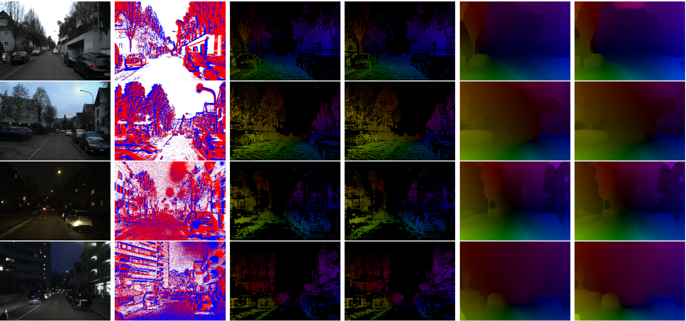
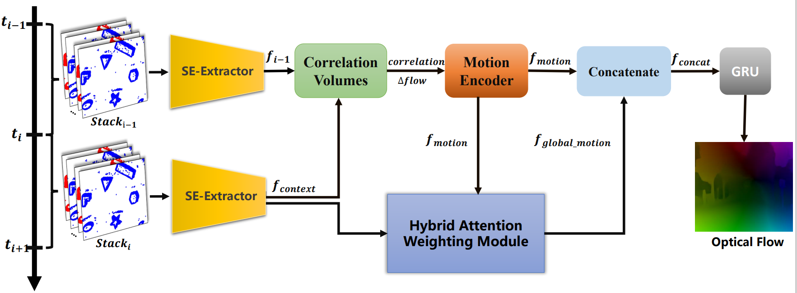

# E-HANet:
受基于标准相机的光流估计算法[RAFT](https://github.com/princeton-vl/RAFT)和注意力机制启发，提出提出基于事件的混合注意力网络E-HANet (Event-based Hybrid Attention Network)用于稠密光流估计

## 算法总体网络框架
将时间窗口上相邻的两组事件表示为正负堆叠事件片分别输入权重共享的SE-特征提取器，输出𝑓_(𝑖−1) 和𝑓_𝑐𝑜𝑛𝑡𝑒𝑥𝑡，两者用于计算相关性矩阵和运动特征。混合注意力加权模块分别对事件特征𝑓_𝑐𝑜𝑛𝑡𝑒𝑥𝑡和运动特征𝑓_𝑚𝑜𝑡𝑖𝑜𝑛计算空间注意力和通道注意力，实现运动特征的全局聚合。最后使用GRU模型对光流进行迭代更新。

## Datasets

### [DSEC](https://dsec.ifi.uzh.ch/)

### [MVSEC](https://daniilidis-group.github.io/mvsec/)
